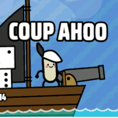

# Coup Ahoo



## Story

You're finally fed up with your fleet and their incompetence. Take down all 13 of them one by one and claim your spot at the top. Along the way, you'll discover precious cargo dice that represent your ship's vitality and firepower. You may also encounter friendly merchants, carpenters, and potential crew members eager to join and assist you on your journey.

The game is played entirely with a mouse (or touch). You can mute the game by pressing M.

Your ship's cargo consists of dice, and their total pip values represent your ship's total HP. These dice also influence the number of damage dice you roll in combat. Be careful not to let your cargo's total value reach the dreaded number, as even rolling that in combat can have unfavorable consequences.

NOTE: **Landscape** is highly recommended for mobile.

## Contributing

### Installing Dependencies

After cloning this repo, install dependecies:

```
pnpm i
```

### Checking code format

```
pnpm check
```

### Testing the app in the browser

To test your work in your browser (with hot reloading!) while developing:

```
pnpm start
# Alternatively to test in a more advanced WebXDC emulator:
pnpm emulator
```

### Building

To package the WebXDC file:

```
pnpm build
```

To package the WebXDC with developer tools inside to debug in Delta Chat, set the `NODE_ENV`
environment variable to "debug":

```
NODE_ENV=debug pnpm build
```

The resulting optimized `.xdc` file is saved in `dist-xdc/` folder.

### Releasing

To automatically build and create a new GitHub release with the `.xdc` file:

```
git tag -a v1.0.1
git push origin v1.0.1
```
